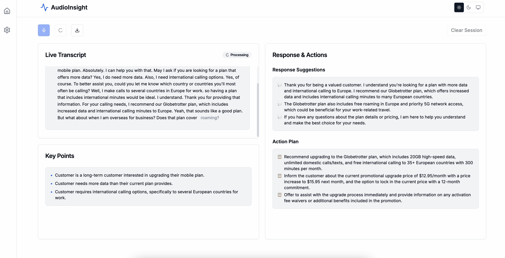

# AudioInsight

> **Built on top of [WhisperLiveKit](https://github.com/QuentinFuxa/WhisperLiveKit) which built on top of [whisper_streaming](https://github.com/ufal/whisper_streaming).**

> **Real-time, Fully Local Speech-to-Text with Speaker Diarization and LLM-powered Transcript Analysis**

Transform speech into text instantly with AudioInsight - a production-ready streaming ASR system that runs entirely on your machine. Built on OpenAI's Whisper with advanced LocalAgreement streaming algorithms for low-latency, accurate transcription, enhanced with intelligent LLM-powered conversation analysis.



---

## ⚡ Quick Start

- Get up and running in seconds with one of the following options:

### Option 1: Full-stack with uv (recommended)

```bash
# Install uv (if not installed)
curl -LsSf https://astral.sh/uv/install.sh | sh

# Clone and install dependencies
git clone https://github.com/teron131/AudioInsight.git
cd AudioInsight
uv sync

# Start both backend and frontend
npm run dev

# Backend: http://localhost:8080
# Frontend: http://localhost:3030
```

### Option 2: Traditional pip

```bash
# Clone and install dependencies
git clone https://github.com/teron131/AudioInsight.git
cd AudioInsight
pip install -e .
npm install --prefix audioinsight-ui

# Start both backend and frontend
npm run dev

# Backend: http://localhost:8080
# Frontend: http://localhost:3030
```

## 🎯 Why AudioInsight?

AudioInsight solves the fundamental challenge of real-time speech recognition by transforming OpenAI's batch-processing Whisper into a streaming system with **LocalAgreement-2** algorithms that ensure stable, coherent output. Enhanced with intelligent LLM-powered analysis for conversation understanding and analysis.

### ✨ Core Advantages

🔒 **100% Local Processing** - No data leaves your machine (except optional LLM API calls)  
🎙️ **Real-time Streaming** - See words appear as you speak with smooth updates  
👥 **Multi-Speaker Support** - Identify different speakers automatically  
🧠 **LLM-Powered Analysis** - Intelligent conversation analysis and text parsing  
🌐 **Multi-User Ready** - Handle multiple sessions simultaneously  
⚡ **Ultra-Low Latency** - Optimized streaming algorithms with simple async processing  
🛠️ **Production Ready** - Built for real-world applications  
🎯 **Clean Architecture** - Simple async patterns with efficient processing  
📁 **Comprehensive File Support** - Multiple processing modes for audio files  
🔄 **Unified Processing Pipeline** - Same engine for live and file processing  
📊 **Multiple Response Formats** - JSON, WebSocket, and Server-Sent Events  
🔍 **Intelligent Text Processing** - LLM-based transcript correction and enhancement  
🚀 **Simple Async System** - Direct async/await patterns for clean processing

### 🏗️ Architecture Overview

```mermaid
flowchart TD
    subgraph Client["<b>🌐 CLIENT LAYER</b>"]
        direction LR
        Browser["🖥️ Browser UI<br/>React/Next.js + WebSocket"]
        Audio["🎙️ Audio Capture<br/>MediaRecorder API"]
    end

    subgraph Server["<b>⚡ FASTAPI SERVER LAYER</b>"]
        direction LR
        WS["🔄 WebSocket Handler<br/>Real-time Processing"]
        Files["📁 File Handler<br/>Upload & Streaming"]
        API["🔗 REST API<br/>Configuration & Control"]
    end

    subgraph Core["<b>🔧 CORE PROCESSING LAYER</b>"]
        direction LR
        ASR["🗣️ Whisper ASR<br/>LocalAgreement-2 Streaming"]
        Diarization["👥 Speaker Diarization<br/>Real-time Identification"]
    end

    subgraph LLM["<b>🧠 SIMPLE LLM LAYER</b>"]
        direction TB
        Parser["📝 Text Parser<br/>Direct Async Processing"]
        Analyzer["📊 Conversation Analyzer<br/>Simple Async Processing"]
    end

    %% Main processing flow (solid arrows)
    Browser --> WS
    Audio --> WS
    Files --> API
    API --> WS
    WS --> ASR
    ASR --> Diarization

    %% Simple LLM flow (dashed arrows)
    ASR -.-> Parser
    Diarization -.-> Analyzer

    %% Output flow
    ASR --> WS
    Diarization --> WS
    Parser -.-> WS
    Analyzer -.-> WS
    WS --> Browser

    %% Meaningful color categorization
    classDef frontend fill:#E1F5FE,stroke:#0288D1,stroke-width:2px,color:#01579B
    classDef communication fill:#E8F5E8,stroke:#4CAF50,stroke-width:2px,color:#1B5E20
    classDef processing fill:#FFF3E0,stroke:#FF9800,stroke-width:2px,color:#E65100
    classDef intelligence fill:#F3E5F5,stroke:#9C27B0,stroke-width:2px,color:#4A148C

    %% Apply colors by function
    class Browser,Audio frontend
    class WS,Files,API communication
    class ASR,Diarization processing
    class Parser,Analyzer intelligence
```



**🎯 Key Architecture Principles:**

🔄 **Simple Async Design**: Clean async/await patterns for all processing components  
⚡ **Direct Processing**: Words appear instantly as spoken with LocalAgreement-2 algorithms  
🧠 **Integrated Analysis**: Simple async LLM processing that enhances transcripts cleanly  
🌐 **Unified Processing**: Same engine handles live audio and file uploads seamlessly  
🎙️ **Multi-Speaker Aware**: Real-time speaker identification integrated with transcription flow  
🔤 **Smart Text Processing**: Intelligent transcript correction and enhancement via direct async calls

---

## 🚀 Installation & Setup

### Standard Installation

```bash
# Clone the repository
git clone https://github.com/teron131/AudioInsight
cd AudioInsight

# Install in development mode
pip install -e .
```

### Development Installation with Full Features

```bash
# Install with all features
pip install -e ".[complete]"

# Or install specific feature sets
pip install -e ".[diarization,llm]"  # Speaker diarization + LLM analysis
pip install -e ".[vac,whisper]"      # Voice activity + Whisper variants
```

### System Requirements

**Required:**
```bash
# FFmpeg (audio processing)
sudo apt install ffmpeg        # Ubuntu/Debian
brew install ffmpeg           # macOS
# Windows: Download from https://ffmpeg.org
```

**Optional Enhancements:**
```bash
# Voice Activity Detection (recommended)
pip install torch

# Advanced sentence tokenization
pip install mosestokenizer

# Speaker diarization
pip install "audioinsight[diarization]"

# LLM inference capabilities (for conversation analysis)
pip install "audioinsight[llm]"

# Alternative Whisper backends
pip install "audioinsight[whisper]"   # Original Whisper
pip install "audioinsight[openai]"    # OpenAI API
```

### Speaker Diarization Setup

For multi-speaker identification, configure pyannote.audio:

1. Accept terms for required models:
   - [pyannote/segmentation](https://huggingface.co/pyannote/segmentation)
   - [pyannote/segmentation-3.0](https://huggingface.co/pyannote/segmentation-3.0)
   - [pyannote/embedding](https://huggingface.co/pyannote/embedding)

2. Login to Hugging Face:
   ```bash
   pip install huggingface_hub
   huggingface-cli login
   ```

### LLM Configuration

For intelligent conversation analysis, set up API keys:

```bash
# OpenAI API (for GPT models)
export OPENAI_API_KEY="your-openai-api-key"

# OpenRouter API (for access to multiple models)
export OPENROUTER_API_KEY="your-openrouter-api-key"

# Google AI API (for Gemini models)
export GOOGLE_API_KEY="your-google-api-key"
```

---

## 💡 Usage Guide

### Command Line Interface

**Basic Usage:**
```bash
# English transcription with default model
audioinsight-server

# Advanced configuration with LLM analysis
audioinsight-server \
  --model large-v3-turbo \
  --language auto \
  --diarization \
  --llm-inference \
  --fast-llm "openai/gpt-4.1-nano" \
  --base-llm "openai/gpt-4.1-mini" \
  --host 0.0.0.0 \
  --port 8080
```

**LLM-Enhanced Processing:**
```bash
# Enable conversation analysis with custom settings
audioinsight-server \
  --model large-v3-turbo \
  --diarization \
  --llm-inference \
  --fast-llm "openai/gpt-4.1-nano" \
  --base-llm "anthropic/claude-3-haiku"
```

**SSL/HTTPS Support:**
```bash
audioinsight-server \
  --ssl-certfile cert.pem \
  --ssl-keyfile key.pem
# Access via https://localhost:8080
```

### Full-Stack Development

**Start Both Frontend and Backend:**
```bash
# From project root - starts both services
npm run dev
# Backend: http://localhost:8080
# Frontend: http://localhost:3030
```

**Individual Services:**
```bash
# Backend only
./start.sh
# Or: audioinsight-server

# Frontend only  
cd audioinsight-ui && npm run dev:frontend
```

### Python Integration

**Basic Server with LLM Analysis:**
```python
from audioinsight import AudioInsight, AudioProcessor
from fastapi import FastAPI, WebSocket
from fastapi.responses import HTMLResponse
import asyncio

# Initialize with LLM analysis
app = FastAPI()
kit = AudioInsight(
    model="large-v3-turbo", 
    diarization=True,
    llm_inference=True,
    fast_llm="openai/gpt-4.1-nano",
    base_llm="openai/gpt-4.1-mini"
)

@app.get("/")
async def get_interface():
    return HTMLResponse(kit.web_interface())

@app.websocket("/asr")
async def websocket_endpoint(websocket: WebSocket):
    await websocket.accept()
    
    # Create session-specific processor with simple LLM analysis
    processor = AudioProcessor()
    
    # Start processing pipeline
    results_generator = await processor.create_tasks()
    
    # Handle bidirectional communication
    async def send_results():
        async for result in results_generator:
            # Results include LLM analyses processed with direct async calls
            if result.get('type') == 'analysis':
                print(f"LLM Analysis: {result['content']}")
            await websocket.send_json(result)
    
    send_task = asyncio.create_task(send_results())
    
    try:
        while True:
            # Receive audio data
            audio_data = await websocket.receive_bytes()
            await processor.process_audio(audio_data)
    except Exception as e:
        print(f"Connection closed: {e}")
    finally:
        send_task.cancel()
        await processor.cleanup()
```

**LLM Integration Example:**
```python
from audioinsight.llm import Analyzer, Parser, UniversalLLM
from audioinsight.llm.llm_config import LLMConfig, LLMTrigger, ParserConfig
import asyncio

async def llm_transcript_analysis():
    """Example of using LLM components for transcript analysis."""
    
    # Configure LLM for analysis with simple async processing
    analyzer_config = LLMConfig(
        model_id="openai/gpt-4.1-mini",
        temperature=0.0  # Fixed for consistent results
    )
    
    # Initialize analyzer with simple async processing
    analyzer = Analyzer(config=analyzer_config)
    
    # Start analyzer (simple initialization)
    await analyzer.initialize()
    
    # Simulate transcript updates (direct async processing)
    transcript_text = "Speaker 1: Hello, how are you today? Speaker 2: I'm doing well, thanks for asking!"
    await analyzer.update_transcription(transcript_text)
    
    # Text parsing example with direct async calls
    parser_config = ParserConfig(model_id="openai/gpt-4.1-nano")
    parser = Parser(config=parser_config)
    
    corrected_text = await parser.parse_text("This is a transcript with potential errors...")
    print(f"Corrected: {corrected_text}")
```

---

## ⚙️ Configuration Reference

### Core Parameters

| Parameter | Description | Default | Options |
|-----------|-------------|---------|---------|
| `--model` | Whisper model size | `large-v3-turbo` | `tiny`, `base`, `small`, `medium`, `large-v3-turbo` |
| `--language` | Source language | `auto` | Language codes such as `en`, `zh`, `ja`, etc. |
| `--task` | Processing task | `transcribe` | `transcribe`, `translate` |
| `--backend` | Whisper backend | `faster-whisper` | `faster-whisper`, `openai-api` |

### Advanced Options

| Parameter | Description | Default |
|-----------|-------------|---------|
| `--diarization` | Enable speaker identification | `False` |
| `--confidence-validation` | Use confidence scores for faster output | `False` |
| `--vac` | Voice Activity Controller | `False` |
| `--no-vad` | Disable Voice Activity Detection | `False` |
| `--min-chunk-size` | Minimum audio chunk (seconds) | `0.5` |
| `--buffer-trimming` | Buffer management strategy | `segment` |
| `--buffer-trimming-sec` | Buffer trimming threshold (seconds) | `15.0` |
| `--vac-chunk-size` | VAC sample size (seconds) | `0.04` |

### LLM Configuration

| Parameter | Description | Default |
|-----------|-------------|---------|
| `--llm-inference` | Enable LLM-based transcript analysis | `True` |
| `--fast-llm` | Fast LLM model for text parsing | `openai/gpt-4.1-nano` |
| `--base-llm` | Base LLM model for analysis | `openai/gpt-4.1-mini` |

> **Note:** Model IDs follow the format `provider/model-name` (e.g., `openai/gpt-4.1-mini`, `anthropic/claude-3-haiku`)

### Server Configuration

| Parameter | Description | Default |
|-----------|-------------|---------|
| `--host` | Server bind address | `localhost` |
| `--port` | Server port | `8080` |
| `--ssl-certfile` | SSL certificate path | `None` |
| `--ssl-keyfile` | SSL private key path | `None` |

### API Endpoints

AudioInsight provides comprehensive API endpoints for different processing modes:

| Endpoint | Method | Purpose | Response Format |
|----------|--------|---------|-----------------|
| `/` | GET | Web interface | HTML |
| `/asr` | WebSocket | Real-time transcription (live + file) with integrated LLM analysis | WebSocket JSON |
| `/upload-file` | POST | Prepare file for WebSocket processing | JSON |
| `/upload` | POST | Direct file processing with integrated LLM analysis | JSON |
| `/upload-stream` | POST | File processing with real-time updates | Server-Sent Events |
| `/cleanup-file` | POST | Clean up temporary files | JSON |
| `/cleanup-session` | POST | Reset all processing state | JSON |

**Additional API Endpoints:**
- `/api/config/*` - Configuration management
- `/api/models/*` - Model status and management
- `/api/llm/*` - LLM processing status and testing
- `/api/transcript-parser/*` - Transcript parsing management
- `/api/batch/*` - Batch processing operations

**Processing Modes:**
- **Live Recording**: Direct WebSocket connection with browser microphone and real-time LLM analysis
- **File Upload + WebSocket**: Unified processing through WebSocket with real-time simulation and integrated LLM analysis
- **Direct File Processing**: Immediate processing with complete JSON response including LLM insights
- **Streaming File Processing**: Real-time progress updates via Server-Sent Events with integrated LLM analysis

---

## 🔬 How It Works

### LocalAgreement-2 Streaming Algorithm

AudioInsight's core innovation is the **LocalAgreement-2** policy that solves output stability in streaming ASR:

```python
# Simplified algorithm concept
def commit_tokens(previous_hypothesis, current_hypothesis):
    """Commit tokens that appear in both consecutive hypotheses"""
    committed = []
    for i, (prev_token, curr_token) in enumerate(zip(previous_hypothesis, current_hypothesis)):
        if prev_token.text == curr_token.text:
            committed.append(curr_token)
        else:
            break  # Stop at first disagreement
    return committed
```

### Simple LLM-Powered Conversation Analysis

AudioInsight enhances raw transcription with intelligent analysis using clean async patterns:

```python
# Simple async LLM analysis workflow
async def analyze_conversation(transcript_text, speaker_info):
    """Analyze conversation for insights using direct async calls"""
    # 1. Direct async text parsing
    parsed_text = await parser.process_text(transcript_text)
    
    # 2. Simple conversation analysis
    if should_trigger_analysis(speaker_info):
        analysis_result = await analyzer.analyze_conversation(transcript_text)
        return analysis_result
    
    # Return processed transcript with enhancements
    return parsed_text
```

### Simple Async Architecture

AudioInsight's LLM layer uses clean async patterns for efficient processing:

```python
# Simple async processing
class SimpleProcessor:
    def __init__(self, config):
        self.config = config
        self.client = UniversalLLM(config)
    
    async def process_text(self, text):
        """Process text using direct async calls"""
        try:
            result = await self.client.process(text)
            return result
        except Exception as e:
            logger.warning(f"LLM processing failed: {e}")
            return text  # Return original text on failure
    
    async def initialize(self):
        """Simple initialization without complex worker management"""
        await self.client.initialize()
```

**Architecture Benefits:**
- **Clean Async Patterns**: Direct async/await for all operations
- **Simple Error Handling**: Straightforward error recovery patterns
- **Easy Maintenance**: Clear, readable code structure
- **Reliable Processing**: Proven async patterns for stable operation
- **Configuration-Driven**: Environment-based feature management

### Processing Pipeline

1. **Audio Capture** → Browser MediaRecorder API captures audio
2. **Format Conversion** → FFmpeg converts WebM/Opus to PCM 
3. **Streaming Buffer** → LocalAgreement-2 manages token validation
4. **Speaker Diarization** → Parallel speaker identification (optional)
5. **Display Enhancement** → Smart text formatting and presentation
6. **Simple LLM Analysis** → Direct async text processing and conversation analysis
7. **Real-time Output** → JSON responses via WebSocket with enhanced insights

---

## 🐋 Docker Deployment

### Quick Start

```bash
# Build image with LLM support
docker build -t audioinsight .

# Run with GPU support (recommended) and integrated LLM analysis
docker run --gpus all -p 8080:8080 \
  -e OPENAI_API_KEY="your-key" \
  -e GOOGLE_API_KEY="your-key" \
  audioinsight --llm-inference

# CPU-only (slower but compatible)
docker run -p 8080:8080 \
  -e OPENAI_API_KEY="your-key" \
  audioinsight --llm-inference
```

### Custom Configuration

```bash
# Custom model and settings with integrated LLM
docker run --gpus all -p 8080:8080 \
  -e OPENAI_API_KEY="your-key" \
  audioinsight \
  --model base \
  --diarization \
  --language auto \
  --llm-inference \
  --fast-llm "openai/gpt-4.1-nano" \
  --base-llm "openai/gpt-4.1-mini"
```

### Build Arguments

```bash
# Include additional features
docker build \
  --build-arg EXTRAS="complete" \
  --build-arg HF_TOKEN="your_hf_token" \
  -t audioinsight-full .
```

---

## 🌐 Production Deployment

### Nginx Reverse Proxy

```nginx
server {
    listen 80;
    server_name your-domain.com;
    
    # WebSocket support
    location / {
        proxy_pass http://localhost:8080;
        proxy_http_version 1.1;
        proxy_set_header Upgrade $http_upgrade;
        proxy_set_header Connection "upgrade";
        proxy_set_header Host $host;
        proxy_set_header X-Real-IP $remote_addr;
        proxy_cache_bypass $http_upgrade;
    }
}
```

### Environment Variables

```bash
# LLM API Keys
export OPENAI_API_KEY="your-openai-key"
export OPENROUTER_API_KEY="your-openrouter-key"  
export GOOGLE_API_KEY="your-google-key"

# Model configurations
export WHISPER_MODEL="large-v3-turbo"
export LLM_FAST_LLM="openai/gpt-4.1-nano"
export LLM_BASE_LLM="openai/gpt-4.1-mini"
```

### Process Management

```bash
# Using systemd with LLM support
sudo systemctl enable audioinsight
sudo systemctl start audioinsight

# Using PM2 with environment variables
pm2 start "audioinsight-server --model large-v3-turbo --llm-inference" \
  --name audioinsight \
  --env OPENAI_API_KEY="your-key"

# Using Docker Compose
docker-compose up -d
```
