# AudioInsight

> **Built on top of [WhisperLiveKit](https://github.com/QuentinFuxa/WhisperLiveKit) which built on top of [whisper_streaming](https://github.com/ufal/whisper_streaming).**

> **Real-time, Fully Local Speech-to-Text with Speaker Diarization and LLM-powered Transcript Analysis**

Transform speech into text instantly with AudioInsight - a production-ready streaming ASR system that runs entirely on your machine. Built on OpenAI's Whisper with advanced LocalAgreement streaming algorithms for low-latency, accurate transcription, enhanced with intelligent LLM-powered conversation analysis.

---

## ⚡ Quick Start

Get up and running in seconds:

```bash
# Install AudioInsight
pip install -e .

# Start the server with LLM analysis
audioinsight-server --llm-inference

# Open http://localhost:8080 and start speaking! 🎤
```

## 🎯 Why AudioInsight?

AudioInsight solves the fundamental challenge of real-time speech recognition by transforming OpenAI's batch-processing Whisper into a streaming system with **LocalAgreement-2** algorithms that ensure stable, coherent output. Enhanced with intelligent LLM-powered analysis for conversation understanding and analysis.

### ✨ Core Advantages

🔒 **100% Local Processing** - No data leaves your machine (except optional LLM API calls)  
🎙️ **Real-time Streaming** - See words appear as you speak with 20 FPS updates  
👥 **Multi-Speaker Support** - Identify different speakers automatically  
🧠 **LLM-Powered Analysis** - Intelligent conversation analysis and text parsing  
🌐 **Multi-User Ready** - Handle multiple sessions simultaneously  
⚡ **Ultra-Low Latency** - Optimized streaming algorithms with non-blocking concurrent processing  
🛠️ **Production Ready** - Built for real-world applications  
🎯 **Non-Blocking Event Architecture** - True parallel processing without transcription delays  
📁 **Comprehensive File Support** - Multiple processing modes for audio files  
🔄 **Unified Processing Pipeline** - Same engine for live and file processing  
📊 **Multiple Response Formats** - JSON, WebSocket, and Server-Sent Events  
🔍 **Intelligent Text Processing** - LLM-based transcript correction and enhancement  
🚀 **Non-Blocking Worker System** - Multi-threaded LLM processing with zero transcription lag

### 🏗️ Architecture Overview

```mermaid
flowchart TD
    subgraph Client["<b>🌐 CLIENT LAYER</b>"]
        direction LR
        Browser["🖥️ Browser UI<br/>React/Next.js + WebSocket"]
        Audio["🎙️ Audio Capture<br/>MediaRecorder API"]
    end

    subgraph Server["<b>⚡ FASTAPI SERVER LAYER</b>"]
        direction LR
        WS["🔄 WebSocket Handler<br/>Real-time Processing"]
        Files["📁 File Handler<br/>Upload & Streaming"]
        API["🔗 REST API<br/>Configuration & Control"]
    end

    subgraph Core["<b>🔧 CORE PROCESSING LAYER</b>"]
        direction LR
        ASR["🗣️ Whisper ASR<br/>LocalAgreement-2 Streaming"]
        Diarization["👥 Speaker Diarization<br/>Real-time Identification"]
        Display["📺 Display Parser<br/>Text Enhancement"]
    end

    subgraph LLM["<b>🧠 NON-BLOCKING LLM LAYER</b>"]
        direction TB
        Queue["🔄 Fire-and-Forget Queues<br/>Zero Transcription Lag"]
        subgraph Workers["<b>Parallel Workers (8 Thread Pool)</b>"]
            direction LR
            Parser["📝 Text Parser<br/>⚡ 2 Workers"]
            Analyzer["📊 Conversation Analysis<br/>⚡ 2 Workers"]
        end
    end

    %% Main processing flow (solid arrows)
    Browser --> WS
    Audio --> WS
    Files --> API
    API --> WS
    WS --> ASR
    ASR --> Diarization
    ASR --> Display

    %% Non-blocking LLM flow (dashed arrows)
    ASR -.-> Queue
    Diarization -.-> Queue
    Display -.-> Queue
    Queue --> Workers

    %% Output flow
    ASR --> WS
    Diarization --> WS
    Display --> WS
    Workers -.-> WS
    WS --> Browser

    %% Meaningful color categorization
    classDef frontend fill:#E1F5FE,stroke:#0288D1,stroke-width:2px,color:#01579B
    classDef communication fill:#E8F5E8,stroke:#4CAF50,stroke-width:2px,color:#1B5E20
    classDef processing fill:#FFF3E0,stroke:#FF9800,stroke-width:2px,color:#E65100
    classDef intelligence fill:#F3E5F5,stroke:#9C27B0,stroke-width:2px,color:#4A148C
    classDef infrastructure fill:#F5F5F5,stroke:#757575,stroke-width:2px,color:#212121

    %% Apply colors by function
    class Browser,Audio frontend
    class WS,Files,API communication
    class ASR,Diarization,Display processing
    class Parser,Analyzer intelligence
    class Queue,Workers infrastructure
```



**🎯 Key Architecture Principles:**

🔄 **Non-Blocking Design**: LLM processing runs in parallel without affecting real-time transcription  
⚡ **Zero-Lag Streaming**: Words appear instantly as spoken with LocalAgreement-2 algorithms  
🧠 **Intelligent Background Analysis**: 4+ concurrent workers enhance transcripts without delays  
🌐 **Unified Processing**: Same engine handles live audio and file uploads seamlessly  
🎙️ **Multi-Speaker Aware**: Real-time speaker identification integrated with transcription flow  
📺 **Enhanced Display**: Smart text formatting and presentation optimization

---

## 🚀 Installation & Setup

### Standard Installation

```bash
# Clone the repository
git clone https://github.com/teron131/AudioInsight
cd AudioInsight

# Install in development mode
pip install -e .
```

### Development Installation with Full Features

```bash
# Install with all features
pip install -e ".[complete]"

# Or install specific feature sets
pip install -e ".[diarization,llm]"  # Speaker diarization + LLM analysis
pip install -e ".[vac,whisper]"      # Voice activity + Whisper variants
```

### System Requirements

**Required:**
```bash
# FFmpeg (audio processing)
sudo apt install ffmpeg        # Ubuntu/Debian
brew install ffmpeg           # macOS
# Windows: Download from https://ffmpeg.org
```

**Optional Enhancements:**
```bash
# Voice Activity Detection (recommended)
pip install torch

# Advanced sentence tokenization
pip install mosestokenizer

# Speaker diarization
pip install "audioinsight[diarization]"

# LLM inference capabilities (for conversation analysis)
pip install "audioinsight[llm]"

# Alternative Whisper backends
pip install "audioinsight[whisper]"   # Original Whisper
pip install "audioinsight[openai]"    # OpenAI API
```

### Speaker Diarization Setup

For multi-speaker identification, configure pyannote.audio:

1. Accept terms for required models:
   - [pyannote/segmentation](https://huggingface.co/pyannote/segmentation)
   - [pyannote/segmentation-3.0](https://huggingface.co/pyannote/segmentation-3.0)
   - [pyannote/embedding](https://huggingface.co/pyannote/embedding)

2. Login to Hugging Face:
   ```bash
   pip install huggingface_hub
   huggingface-cli login
   ```

### LLM Configuration

For intelligent conversation analysis, set up API keys:

```bash
# OpenAI API (for GPT models)
export OPENAI_API_KEY="your-openai-api-key"

# OpenRouter API (for access to multiple models)
export OPENROUTER_API_KEY="your-openrouter-api-key"

# Google AI API (for Gemini models)
export GOOGLE_API_KEY="your-google-api-key"
```

---

## 💡 Usage Guide

### Command Line Interface

**Basic Usage:**
```bash
# English transcription with default model
audioinsight-server

# Advanced configuration with LLM analysis
audioinsight-server \
  --model large-v3-turbo \
  --language auto \
  --diarization \
  --llm-inference \
  --fast-llm "openai/gpt-4.1-nano" \
  --base-llm "openai/gpt-4.1-mini" \
  --host 0.0.0.0 \
  --port 8080
```

**LLM-Enhanced Processing:**
```bash
# Enable conversation analysis with custom settings
audioinsight-server \
  --model large-v3-turbo \
  --diarization \
  --llm-inference \
  --fast-llm "openai/gpt-4.1-nano" \
  --base-llm "anthropic/claude-3-haiku"
```

**SSL/HTTPS Support:**
```bash
audioinsight-server \
  --ssl-certfile cert.pem \
  --ssl-keyfile key.pem
# Access via https://localhost:8080
```

### Full-Stack Development

**Start Both Frontend and Backend:**
```bash
# From project root - starts both services
npm run dev
# Backend: http://localhost:8080
# Frontend: http://localhost:3030
```

**Individual Services:**
```bash
# Backend only
./start.sh
# Or: audioinsight-server

# Frontend only  
cd audioinsight-ui && npm run dev:frontend
```

### Python Integration

**Basic Server with LLM Analysis:**
```python
from audioinsight import AudioInsight, AudioProcessor
from fastapi import FastAPI, WebSocket
from fastapi.responses import HTMLResponse
import asyncio

# Initialize with LLM analysis
app = FastAPI()
kit = AudioInsight(
    model="large-v3-turbo", 
    diarization=True,
    llm_inference=True,
    fast_llm="openai/gpt-4.1-nano",
    base_llm="openai/gpt-4.1-mini"
)

@app.get("/")
async def get_interface():
    return HTMLResponse(kit.web_interface())

@app.websocket("/asr")
async def websocket_endpoint(websocket: WebSocket):
    await websocket.accept()
    
    # Create session-specific processor with non-blocking LLM analysis
    processor = AudioProcessor()
    
    # Start processing pipeline
    results_generator = await processor.create_tasks()
    
    # Handle bidirectional communication
    async def send_results():
        async for result in results_generator:
            # Results include LLM analyses processed in background
            if result.get('type') == 'analysis':
                print(f"LLM Analysis: {result['content']}")
            await websocket.send_json(result)
    
    send_task = asyncio.create_task(send_results())
    
    try:
        while True:
            # Receive audio data
            audio_data = await websocket.receive_bytes()
            await processor.process_audio(audio_data)
    except Exception as e:
        print(f"Connection closed: {e}")
    finally:
        send_task.cancel()
        await processor.cleanup()
```

**LLM Integration Example:**
```python
from audioinsight.llm import Analyzer, Parser, UniversalLLM
from audioinsight.llm.config import LLMConfig, LLMTrigger, ParserConfig
import asyncio

async def llm_transcript_analysis():
    """Example of using LLM components for transcript analysis."""
    
    # Configure LLM for analysis with non-blocking processing
    analyzer_config = LLMConfig(
        model_id="openai/gpt-4.1-mini",
        temperature=0.0  # Fixed for consistent results
    )
    
    # Initialize analyzer with 2 non-blocking workers
    analyzer = Analyzer(config=analyzer_config)
    
    # Start monitoring (non-blocking)
    await analyzer.start_worker()
    
    # Simulate transcript updates (fire-and-forget)
    transcript_text = "Speaker 1: Hello, how are you today? Speaker 2: I'm doing well, thanks for asking!"
    await analyzer.update_transcription(transcript_text)
    
    # Text parsing example with concurrent workers
    parser_config = ParserConfig(model_id="openai/gpt-4.1-nano")
    parser = Parser(config=parser_config)
    
    corrected_text = await parser.parse_text("This is a transcript with potential errors...")
    print(f"Corrected: {corrected_text}")
```

---

## ⚙️ Configuration Reference

### Core Parameters

| Parameter | Description | Default | Options |
|-----------|-------------|---------|---------|
| `--model` | Whisper model size | `large-v3-turbo` | `tiny`, `base`, `small`, `medium`, `large-v3-turbo` |
| `--language` | Source language | `auto` | Language codes such as `en`, `zh`, `ja`, etc. |
| `--task` | Processing task | `transcribe` | `transcribe`, `translate` |
| `--backend` | Whisper backend | `faster-whisper` | `faster-whisper`, `openai-api` |

### Advanced Options

| Parameter | Description | Default |
|-----------|-------------|---------|
| `--diarization` | Enable speaker identification | `False` |
| `--confidence-validation` | Use confidence scores for faster output | `False` |
| `--vac` | Voice Activity Controller | `False` |
| `--no-vad` | Disable Voice Activity Detection | `False` |
| `--min-chunk-size` | Minimum audio chunk (seconds) | `0.5` |
| `--buffer-trimming` | Buffer management strategy | `segment` |
| `--buffer-trimming-sec` | Buffer trimming threshold (seconds) | `15.0` |
| `--vac-chunk-size` | VAC sample size (seconds) | `0.04` |

### LLM Configuration

| Parameter | Description | Default |
|-----------|-------------|---------|
| `--llm-inference` | Enable LLM-based transcript analysis | `True` |
| `--fast-llm` | Fast LLM model for text parsing | `openai/gpt-4.1-nano` |
| `--base-llm` | Base LLM model for analysis | `openai/gpt-4.1-mini` |

> **Note:** Model IDs follow the format `provider/model-name` (e.g., `openai/gpt-4.1-mini`, `anthropic/claude-3-haiku`)

### Server Configuration

| Parameter | Description | Default |
|-----------|-------------|---------|
| `--host` | Server bind address | `localhost` |
| `--port` | Server port | `8080` |
| `--ssl-certfile` | SSL certificate path | `None` |
| `--ssl-keyfile` | SSL private key path | `None` |

### API Endpoints

AudioInsight provides comprehensive API endpoints for different processing modes:

| Endpoint | Method | Purpose | Response Format |
|----------|--------|---------|-----------------|
| `/` | GET | Web interface | HTML |
| `/asr` | WebSocket | Real-time transcription (live + file) with background LLM analysis | WebSocket JSON |
| `/upload-file` | POST | Prepare file for WebSocket processing | JSON |
| `/upload` | POST | Direct file processing with background LLM analysis | JSON |
| `/upload-stream` | POST | File processing with real-time updates | Server-Sent Events |
| `/cleanup-file` | POST | Clean up temporary files | JSON |
| `/cleanup-session` | POST | Reset all processing state | JSON |

**Additional API Endpoints:**
- `/api/display-parser/*` - Display text parsing configuration
- `/api/config/*` - Configuration management
- `/api/models/*` - Model status and management
- `/api/llm/*` - LLM processing status and testing
- `/api/transcript-parser/*` - Transcript parsing management
- `/api/batch/*` - Batch processing operations

**Processing Modes:**
- **Live Recording**: Direct WebSocket connection with browser microphone and real-time LLM analysis
- **File Upload + WebSocket**: Unified processing through WebSocket with real-time simulation and background LLM analysis
- **Direct File Processing**: Immediate processing with complete JSON response including LLM insights
- **Streaming File Processing**: Real-time progress updates via Server-Sent Events with background LLM analysis

---

## 🔬 How It Works

### LocalAgreement-2 Streaming Algorithm

AudioInsight's core innovation is the **LocalAgreement-2** policy that solves output stability in streaming ASR:

```python
# Simplified algorithm concept
def commit_tokens(previous_hypothesis, current_hypothesis):
    """Commit tokens that appear in both consecutive hypotheses"""
    committed = []
    for i, (prev_token, curr_token) in enumerate(zip(previous_hypothesis, current_hypothesis)):
        if prev_token.text == curr_token.text:
            committed.append(curr_token)
        else:
            break  # Stop at first disagreement
    return committed
```

### Non-Blocking LLM-Powered Conversation Analysis

AudioInsight enhances raw transcription with intelligent analysis that never blocks real-time processing:

```python
# Non-blocking LLM analysis workflow
async def analyze_conversation_non_blocking(transcript_text, speaker_info):
    """Analyze conversation for insights without blocking transcription"""
    # 1. Fire-and-forget text parsing (doesn't block transcription)
    asyncio.create_task(parser.queue_for_processing(transcript_text))
    
    # 2. Deferred conversation monitoring (scheduled for next event loop)
    loop = asyncio.get_event_loop()
    loop.call_soon(lambda: monitor_speaker_turns(speaker_info))
    
    # 3. Background analysis (processes in worker threads)
    if should_trigger_analysis():
        # Queue for background processing - returns immediately
        analyzer.queue_for_processing("conversation_trigger")
    
    # Transcription continues immediately while analysis happens in background
    return transcript_text  # Return immediately, no blocking
```

### Non-Blocking Event-Based Architecture

AudioInsight's enhanced LLM layer uses a non-blocking event-based architecture for zero transcription lag:

```python
# Non-blocking event-based processing
class EventBasedProcessor:
    def __init__(self, queue_maxsize=75, max_concurrent_workers=2):
        self.processing_queue = asyncio.Queue(maxsize=queue_maxsize)
        self.worker_tasks = [
            asyncio.create_task(self._worker()) 
            for _ in range(max_concurrent_workers)
        ]
        self.shared_executor = get_shared_executor()  # 8-thread pool
    
    async def queue_for_processing(self, item):
        """Queue item for background processing - returns immediately"""
        try:
            self.processing_queue.put_nowait(item)  # Non-blocking put
            return True
        except asyncio.QueueFull:
            return False  # Queue full, but don't block transcription
    
    async def _worker(self):
        """Individual worker processing items from shared queue in background"""
        while self.is_running:
            item = await self.processing_queue.get()
            if item is None:  # Shutdown signal
                break
            
            # Process using shared thread pool executor (background)
            await self._process_item(item)
            self.processing_queue.task_done()
```

**Performance Optimizations:**
- **Fire-and-Forget Queuing**: Parser and analyzer requests return immediately
- **Shared Thread Pool**: 8-worker thread pool reused across all LLM operations
- **Adaptive Cooldowns**: Dynamic processing frequency based on actual performance
- **Non-Blocking Workers**: 2+ parser workers + 2+ analyzer workers process in background
- **Exception Isolation**: LLM errors never affect transcription flow
- **Ultra-Fast Updates**: 0.05s UI updates (20 FPS) for smooth real-time display

**Key Benefits:**
- **Zero Transcription Lag**: LLM processing never blocks real-time speech recognition
- **Smooth UI Updates**: Words appear immediately as they're recognized
- **Background Intelligence**: Analysis happens transparently in background
- **Fault Tolerance**: LLM failures don't impact core transcription
- **High Throughput**: True parallel processing across all components
- **Responsive Interface**: UI updates at 20 FPS for smooth text streaming

### Processing Pipeline

1. **Audio Capture** → Browser MediaRecorder API captures audio
2. **Format Conversion** → FFmpeg converts WebM/Opus to PCM 
3. **Streaming Buffer** → LocalAgreement-2 manages token validation
4. **Speaker Diarization** → Parallel speaker identification (optional)
5. **Display Enhancement** → Smart text formatting and presentation
6. **Non-Blocking LLM Analysis** → Background text processing and conversation analysis
7. **Real-time Output** → JSON responses via WebSocket with enhanced insights (no delays)

---

## 🐋 Docker Deployment

### Quick Start

```bash
# Build image with LLM support
docker build -t audioinsight .

# Run with GPU support (recommended) and background LLM analysis
docker run --gpus all -p 8080:8080 \
  -e OPENAI_API_KEY="your-key" \
  -e GOOGLE_API_KEY="your-key" \
  audioinsight --llm-inference

# CPU-only (slower but compatible)
docker run -p 8080:8080 \
  -e OPENAI_API_KEY="your-key" \
  audioinsight --llm-inference
```

### Custom Configuration

```bash
# Custom model and settings with background LLM
docker run --gpus all -p 8080:8080 \
  -e OPENAI_API_KEY="your-key" \
  audioinsight \
  --model base \
  --diarization \
  --language auto \
  --llm-inference \
  --fast-llm "openai/gpt-4.1-nano" \
  --base-llm "openai/gpt-4.1-mini"
```

### Build Arguments

```bash
# Include additional features
docker build \
  --build-arg EXTRAS="complete" \
  --build-arg HF_TOKEN="your_hf_token" \
  -t audioinsight-full .
```

---

## 🌐 Production Deployment

### Nginx Reverse Proxy

```nginx
server {
    listen 80;
    server_name your-domain.com;
    
    # WebSocket support
    location / {
        proxy_pass http://localhost:8080;
        proxy_http_version 1.1;
        proxy_set_header Upgrade $http_upgrade;
        proxy_set_header Connection "upgrade";
        proxy_set_header Host $host;
        proxy_set_header X-Real-IP $remote_addr;
        proxy_cache_bypass $http_upgrade;
    }
}
```

### Environment Variables

```bash
# LLM API Keys
export OPENAI_API_KEY="your-openai-key"
export OPENROUTER_API_KEY="your-openrouter-key"  
export GOOGLE_API_KEY="your-google-key"

# Model configurations
export WHISPER_MODEL="large-v3-turbo"
export LLM_FAST_LLM="openai/gpt-4.1-nano"
export LLM_BASE_LLM="openai/gpt-4.1-mini"
```

### Process Management

```bash
# Using systemd with LLM support
sudo systemctl enable audioinsight
sudo systemctl start audioinsight

# Using PM2 with environment variables
pm2 start "audioinsight-server --model large-v3-turbo --llm-inference" \
  --name audioinsight \
  --env OPENAI_API_KEY="your-key"

# Using Docker Compose
docker-compose up -d
```
